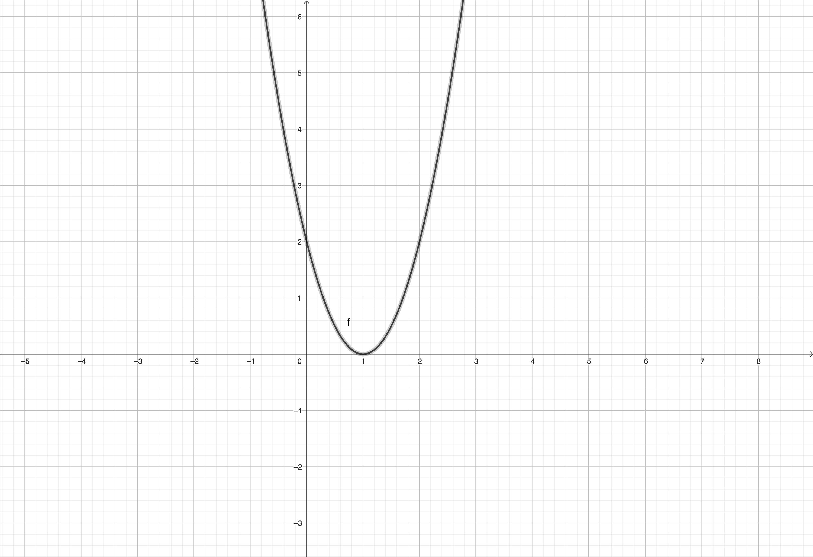
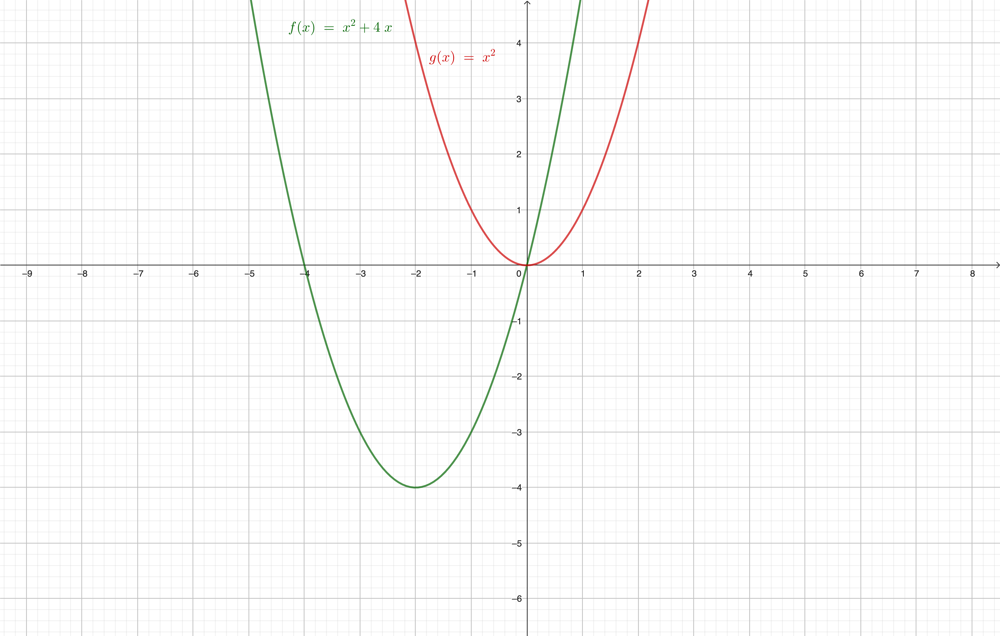

# Quadratic Equations and Parabolas

Quadratic equations are polynomial equations of the second degree, commonly written in the form:

```math
ax^2 + bx + c = 0
```

where $`a`$, $`b`$, and $`c`$ are constants, and $`x`$ represents the variable.

## The Quadratic Formula

The solutions to a quadratic equation can be found using the quadratic formula:

```math
x = \frac{{-b \pm \sqrt{{b^2 - 4ac}}}}{{2a}}
```

## Relationship with Parabolas

Quadratic equations are closely related to the graph of a parabola. The general form of a quadratic equation can be expressed as:

```math
f(x) = ax^2 + bx + c
```

The graph of this equation is a parabola, which can open upwards or downwards depending on the sign of $`a`$.

- If $`a > 0`$, the parabola opens upwards.
- If $`a < 0`$, the parabola opens downwards.

## Example

Consider the quadratic equation $`y = 2x^2 - 4x + 2`$.

```math
y = 2x^2 - 4x + 2
```

The corresponding parabola opens upwards because $`a = 2 > 0`$.

### Drawing of the Parabola

```math
\begin{align*}
f(x) &= 2x^2 - 4x + 2 \\
&= 2(x^2 - 2x) + 2 \\
&= 2(x^2 - 2x + 1) + 2 - 2 \\
&= 2(x - 1)^2 + 0
\end{align*}
```

```math
\text{Vertex form: } f(x) = a(x - h)^2 + k
```

In this form, the vertex of the parabola is at $`(h, k)`$. For our example, the vertex is $`(1, 0)`$.

```math
\text{Vertex: } (1, 0)
```

The vertex form allows us to easily identify the vertex and understand the direction in which the parabola opens.

### Graph



This graph represents the parabola $`y = 2x^2 - 4x + 2`$, with the vertex at $`(1, 0)`$ and an upward opening.


## Coefficient `b` in Quadratic Equations and Parabolas

In the quadratic equation $ax^2 + bx + c = 0$ and the function $f(x) = ax^2 + bx + c$, `b` is the coefficient of the linear term (`bx`). This coefficient has several effects on the properties of the quadratic equation and the parabola it represents:

### Example 1: Quadratic Function with $b = 0$

Consider the quadratic function $f(x) = x^2$. This function has a $b$ coefficient of 0. The graph of this function is a parabola that opens upwards and is symmetric about the y-axis (the line $x = 0$).

### Example 2: Quadratic Function with $b = 4$

Now consider the quadratic function $f(x) = x^2 + 4x$. This function has a $b$ coefficient of 4. The graph of this function is also a parabola that opens upwards, but it is not symmetric about the y-axis. Instead, it is symmetric about the line $x = -2$, which is given by the formula $x = -\frac{b}{2a}$.

Comparing these two examples, we can see that changing the $b$ coefficient shifts the parabola horizontally along the x-axis. The vertex of the parabola, which was at the origin in the first example, has moved to the point $(-2, -4)$ in the second example.

### Display

This is how the above examples behave, when displayed as a parabola




## Vertex (Scheitelpunktform)

### $f(x) = a(x-u)^2+v$

**Important**: $a$ is written before the parantheses, $(ax-u)^2$ is *not* a valid Vertex formula. It is required to be formed as $a(x-u)^2$


#### Converting from one form to another
- Example 1
    Convert $f(x)=8(x+0.5)^2-1$ to the basic formula.
    - $f(x)=8(x^2+x+0.25)-1$
    - $f(x)=8x^2+8x+2-1$
    - $\underline{\underline{f(x)=8x^2+8x+1}}$
Which then means, $a=8, \space b=8, \space c=1$

- Example 2
    Convert $f(x)=3x^2-12x-18$ to the Vertex formula
    - $f(x)=3(x^2-4x-6)$ || [Complete the square](./calculating_squares.md)
    - $f(x)=3(x^2-4x+4-4-6)$
    - $f(x)=3((x-2)^2-10)$
    - $\underline{\underline{f(x)=3(x-2)^2-30}}$

#### Calculating the vertex

In this section, we are calculating the vertex of a parabola. The vertex is the point where the parabola turns.

- Example 1

Here, we're given the function f(x) = -6(3x - 1)^2. We're rewriting this function in vertex form, which is a(x-h)^2 + k, where (h, k) is the vertex of the parabola.

$$
\begin{align*}
f(x) &= -6(3x - 1)^2 \\
&= -6(3(x-\frac{1}{3}))^2 \\
&= -6(3^2(x-\frac{1}{3})^2) \\
&= -6*9(x-\frac{1}{3})^2 \\
&= -54(x-\underline{\underline{\frac{1}{3}}})^2 + \underline{\underline{0}} \\
\end{align*}
$$

The vertex of this function is at the point (1/3, 0).

- Example 2

In this example, the function g(x) is already in vertex form. The vertex is (-0.5, -1).

$$
\begin{align*}
g(x) &=8(x + \underline{0.5})^2 \underline{- 1} \\
\end{align*}
$$

- Example 3

In this example, the function h(x) is rewritten in vertex form. The vertex is (-2, 0).

$$
\begin{align*}
h(x) &=(4 + 2x)^2 \\
&=(2x+4)^2 \\
&=(2(x+2))^2 \\
&=(2^2(x+2)^2) \\
&=4(x+2)^2 \\
\end{align*}
$$

#### Calculate Vertex from Nullpoints

In this section, we calculate the vertex from the null points of a function. The null points are the x-values where the function equals zero. The vertex lies in the center between the two null points.

Example: We have the function $f(x) = 0.25x^2 - x -3$ and the null points $x_01=-2$ and $x_02=6$. The difference between the null points is calculated, then divided by 2 to find the x-coordinate of the vertex. The y-coordinate of the vertex is found by substituting the x-coordinate into the function. The vertex is (2, -4).

We know, that the vertex lies in the center between the two null points.
$$
\Delta x = 6 - (-2) = 8 \\
\downarrow	\\
\frac{\Delta x}{2} = 4
$$
x-Coordinates of the Vertex is then:
$$
\begin{align*}
x_01 + \frac{\Delta x}{2} &= -2 + 4 \\
&=2
\end{align*}
$$

Which means:
$$
\begin{align*}
f(2) &= 0.25(2)^2 - 2 - 3 \\
&= 1 - 2 - 3 \\
&= -4
\end{align*}
$$
$$
\text{Vertex: S} (2, -4)
$$

### Auxiliary Function
1) **Construction of an auxiliary function h** by shifting the original function f in the direction of the y-axis. The advantage of the auxiliary function is that the x-coordinate of the vertex is the same as that of f and the zeros are easier to determine.

2) **Determine the zeros of the auxiliary function.**

3) **Determine the x-coordinate of the vertex** as the midpoint between the two zeros (analogous to the previous example).

4) **Calculate the y-coordinate of the vertex.**

#### Example
Given the function $f(x) = 0.25x^2 - x - 3$, we want to find its vertex.

1) **Construction of an auxiliary function h**

We can construct an auxiliary function by completing the square for the given function. The auxiliary function will have the same vertex as the original function, but its zeros will be easier to determine.

$f(x) = 0.25x^2 - x - 3$ is moved to: $h(x) = 0.25x^2 - x + 0$
Now one of the zeroes is on $(0, 0)$

2) **Determine the zeros of the auxiliary function**

The zeros of the auxiliary function are the solutions to the equation $h(x) = 0$.

$$
\begin{align*}
0.25x^2 - x &= 0 \\
x(0.25x - 1) &= 0 \\
\end{align*}
$$

So, the zeros of the auxiliary function are $x = 0$ and $x = 4$.

3) **Determine the x-coordinate of the vertex**

The x-coordinate of the vertex is the midpoint between the two zeros.

$$
x_{vertex} = \frac{0 + 4}{2} = 2
$$

4) **Calculate the y-coordinate of the vertex**

The y-coordinate of the vertex is found by substituting the x-coordinate into the original function.

$$
\text{Vertex } = 0.25(2)^2 - 3 = -4
$$

So, the vertex of the function $f(x) = 0.25x^2 - x - 3$ is $(2, -4)$.